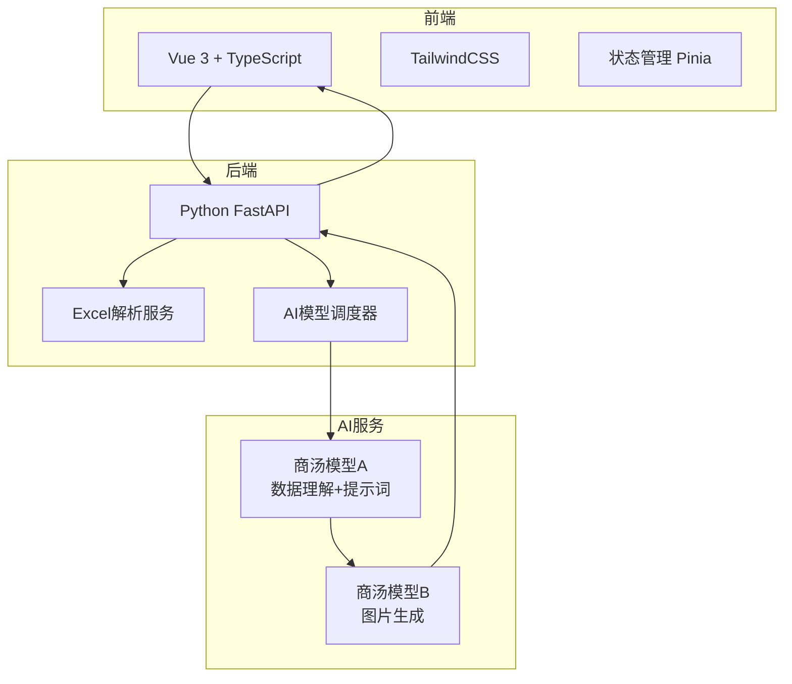

# AI 智能报表生成平台 - 产品需求文档

## 1. 产品概述

一个智能化的AI对话与报表生成平台，用户可以通过自然语言与AI交互，上传Excel数据文件，后端采用**自动分步流程**：先用商汤模型A分析数据生成可视化提示词，再调用商汤模型B生成报表图片，前端用户只需一键操作即可获得结果。

### 核心价值
- **简化数据分析流程**：无需编写复杂公式或代码，通过对话即可完成数据分析
- **后端自动分步**：前端简单交互，后端自动完成提示词生成和图片生成的完整流程
- **多模型协同**：支持商汤模型协同工作，可扩展调用其他模型

### 目标用户
- 业务分析师：需要快速生成数据报表的商业人士
- 数据运营：定期需要数据可视化的运营人员
- 产品经理：需要数据支撑决策的管理层
- 行政人员：需要定期生成统计报告的非技术人员

## 2. 核心功能

### 2.1 功能模块
1. **AI对话界面**：类似豆包的多轮对话界面，支持文本输入
2. **Excel上传系统**：拖拽或点击上传Excel文件，后端实时解析
3. **一键生成**：用户输入需求，后端自动完成两步处理
4. **报表展示**：前端展示生成的图表图片
5. **历史记录管理**：保存对话和生成记录
6. **API配置管理**：后端支持配置多个AI模型

### 2.2 页面详情
| 页面名称 | 模块名称 | 功能描述 |
|----------|----------|----------|
| 首页 | 对话区域 | 主要的AI交互界面，包含消息列表和输入框 |
| 首页 | 文件上传区 | Excel文件上传，支持拖拽，显示已上传文件列表 |
| 首页 | 生成按钮 | 一键生成报表，自动完成后端两步处理 |
| 首页 | 报表展示区 | 展示生成的图表图片 |
| 设置页 | API配置 | 配置商汤模型API密钥 |
| 设置页 | 模型选择 | 选择使用的AI模型组合 |
| 设置页 | 主题设置 | 切换深色/浅色主题 |
| 历史页 | 对话历史 | 查看和管理历史对话记录 |
| 历史页 | 报表收藏 | 保存喜欢的生成报表 |

## 3. 核心流程

### 3.1 前端交互流程（简化）

```mermaid
graph TD
    A[用户上传Excel文件] --> B[用户输入分析需求]
    B --> C[点击"生成报表"按钮]
    C --> D[后端自动处理...]
    D --> E[前端展示结果]
    E --> F[用户下载或分享]
```

**用户操作**：上传Excel → 输入需求 → 点击生成 → 查看结果（后端自动完成两步处理）

### 3.2 后端处理流程（分步自动化）


**后端流程**：
- **Step 1**：商汤模型A分析数据结构，生成可视化提示词
- **Step 2**：商汤模型B根据提示词生成图表图片
- **自动化**：前端只需一次请求，后端自动完成两步

### 3.3 技术架构



**技术说明**：
- **前端（Vue 3）**：轻量级交互界面，只需发起一次请求
- **后端（Python）**：处理所有AI模型调用，自动化完成两步流程
- **商汤模型A**：负责数据理解、提示词生成
- **商汤模型B**：负责图片生成
- **自动化**：后端内部完成Step 1和Step 2，前端无需分步操作

## 4. 用户界面设计

### 4.1 设计风格
- **整体风格**：现代化简约设计，参考豆包/ChatGPT的对话界面
- **配色方案**：
  - 主色：深紫色 `#7C3AED`（代表智能与创造力）
  - 次色：淡紫色 `#A78BFA`
  - 强调色：青色 `#06B6D4`
  - 背景色：深色模式 `#0F172A`，浅色模式 `#F8FAFC`
- **按钮风格**：圆角按钮，带有微妙的渐变和阴影效果
- **字体**：使用思源黑体（中文）+ Inter（英文），层次分明
- **布局**：左侧边栏导航 + 右侧主内容区

### 4.2 页面设计概述

#### 首页（对话界面）
| 模块名称 | UI元素 | 样式描述 |
|----------|--------|----------|
| 消息气泡 | 用户消息/AI消息 | 用户消息右对齐，AI消息左对齐，带有头像 |
| 输入框 | 文本输入 | 底部固定，圆角，带有发送按钮 |
| 文件上传区 | 拖拽区域 | 虚线边框，支持点击上传，显示文件图标和名称 |
| 生成按钮 | 主按钮 | "生成报表"按钮，一键触发后端自动处理 |
| 报表展示 | 图片卡片 | 显示生成的图表图片，支持放大预览和下载 |

#### 设置页面
| 模块名称 | UI元素 | 样式描述 |
|----------|--------|----------|
| API配置表 | 表单输入 | 输入框+保存按钮，密码形式显示密钥 |
| 模型选择 | 下拉选择器 | 选择使用的AI模型组合 |
| 主题切换 | 开关按钮 | 明/暗模式切换，带有图标 |

#### 历史页面
| 模块名称 | UI元素 | 样式描述 |
|----------|--------|----------|
| 对话列表 | 卡片列表 | 显示对话摘要、时间、操作按钮 |
| 报表收藏 | 缩略图网格 | 瀑布流布局，点击查看大图 |

### 4.3 响应式设计
- **桌面优先**：主要针对PC用户优化
- **平板适配**：支持iPad横屏使用
- **移动端适配**：简化界面，保留核心对话功能

### 4.4 交互动效
- **消息出现**：从底部滑入 + 淡入效果
- **文件上传**：拖拽时边框高亮，上传进度环
- **报表生成**：加载动画（脉冲效果），生成完成后淡入
- **按钮交互**：悬停时微微上浮 + 阴影加深
- **页面切换**：淡入淡出过渡

## 5. 性能要求

### 5.1 响应时间
- 消息发送：即时响应（< 100ms）
- Excel上传：后端解析 < 2秒（对于100KB以内的文件）
- 报表生成总时间：< 60秒（后端自动完成两步处理）

### 5.2 支持的文件格式
- Excel: `.xlsx`, `.xls`, `.csv`
- 最大文件大小：10MB
- 最大行数：10万行

## 6. 数据安全

- API密钥：存储在后端配置中，不在前端暴露
- 用户数据：Excel文件上传至后端服务器处理
- 对话记录：后端数据库存储

## 7. 未来扩展方向

- 支持更多数据文件格式（JSON、XML等）
- 支持导出多种格式（PPT、Word等）
- 支持数据库连接
- 支持团队协作功能
